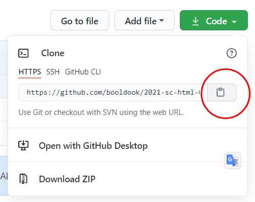

# git을 설치하자
## 1. git을 로컬컴퓨터에 설치하기
[git-scm](https://git-scm.com) 사이트에서 **git설치파일**을 다운로드해서 설치한다.

## 2. 로컬 컴퓨터에서 **한번만** 해야될 작업
```bash
# github id
git config --global user.name 'booldook'

# github email
git config --global user.email 'booldook@gmail.com'
```

## 3. 다른사람의 git 가져오기
```bash
git clone https://github.com/booldook/2021-sc-html-05-flex.git
```



